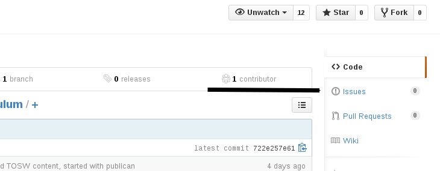

== Introduction

Welcome to the open source book!

=== What Open Source Is

Open Source is a lot of things to a lot of different people.

According to OpenSource.com:

[quote, OpenSource.com, http://opensource.com/resources/what-open-source]
____
The term "open source" refers to something that can be modified because its design is publicly accessible.

While it originated in the context of computer software development, today the term "open source" designates a set of values—what we call the open source way. Open source projects, products, or initiatives are those that embrace and celebrate open exchange, collaborative participation, rapid prototyping, transparency, meritocracy, and community development.
____

Open Source implies some aspects of ownership and control: namely, that users of open source control what they use, and that users of open source have the right to own their own data and work.

This means that if you use an open source program to create an image - InkScape footnote:[InkScape: http://inkscape.org/], for example footnote:[InkScape was, in fact, used for the images in the book] - you have the right to modify how InkScape works, if you like, because the authors granted you that ability by virtue of making InkScape open source.

If you use an open source image format (PNG footnote:[Portable Network Graphics], or SVG footnote:[Scalable Vector Graphics], both of which are used for this book's images), nobody has the right to restrict your usage of the image data.

Consider the alternatives:

* If you used a proprietary text format to write a book footnote:[I wonder what gave me the idea to use a proprietary document processor as an example for this book.], those who work on the document can be forced to  license current versions of the software to alter or view the work.
* If my data is stored in a proprietary format, the owner of the format can require future usages to comply with potentially onerous requirements, meaning that my data can not be seen without encumbrance. footnote:[Retrograde license enforcement has actually happened with the GIF format; the owner of a common compression format often assumed to be part of GIF enforced its license, to the displeasure of all involved. See http://en.wikipedia.org/wiki/Graphics_Interchange_Format#Unisys_and_LZW_patent_enforcement for more details.]

=== Why Open Source is Important

=== Why this curriculum is being developed?

=== How this curriculum is being developed

This book is written with open source in mind.footnote:[It'd be awfully sad if a book about open source were not itself open source. Therefore - and surprise! - it's open source.] It's formatted with http://asciidoctor.org[AsciiDoctor], a variant of http://asciidoc.org[AsciiDoc]; this formats simple, plain text into various presentation formats.

The actual source is available via https://github.com/OSAS/os-curriculum, on https://github.com[GitHub].

==== Getting the book's contents

To work with the book's contents, you will need three programs installed: a text editor footnote:[Some text editors include formatting support, including support for AsciiDoc; these are probably worth searching out.] (included in every modern operating system), `git` footnote:[Git: http://git-scm.com], and `asciidoctor` footnote:[AsciiDoctor: http://asciidoctor.org]. 

On Fedora footnote:[Fedora: http://fedoraproject.org], both programs can be easily installed via `yum`:

   sudo yum install git rubygem-asciidoctor

Other operating systems will have other means by which these can be installed; check their respective websites for more details.

Once you have `git` and `asciidoctor` installed, you can check the book's contents out with a simple console command:

   git clone https://github.com/OSAS/os-curriculum.git

This will create a directory (`os-curriculum`) in the current working directory. The book itself is made of text files with the extension `.adoc` (for "asciidoctor").

Building the book is also very simple:

   asciidoctor book.adoc

==== Contributing to the book

Contributing to this book can be done in a few different ways.

The first is by noting issues with the book footnote:[This is raising awareness of concerns, a core aspect of open source community, as we'll find out in later sections of the book.]; you do this by opening the book's source' website (https://github.com/OSAS/os-curriculum), and adding an issue.

Once an issue is filed, the book's community can address the issue by correcting or adding content. This is the simplest way to actively participate in an open source project.

The other way you can contribute to the book's content is by updating the book yourself. To do this, 

_TODO_ Add note about using git from command line? github?

[bibliography]

- [[opensource_com_what_is_open_source]] http://opensource.com/resources/what-open-source