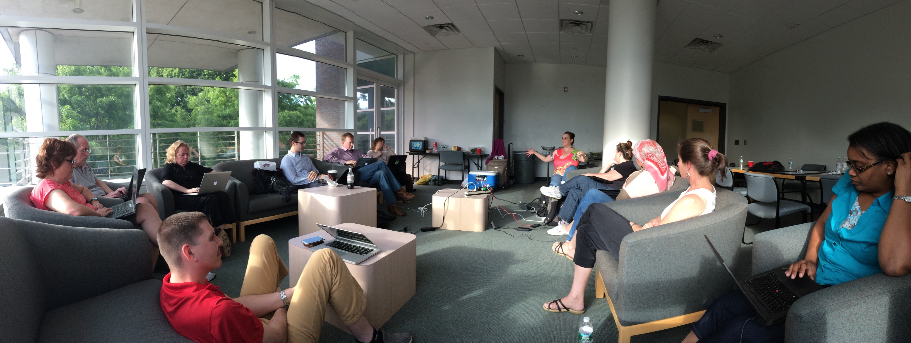

== Teaching Open Source

Teaching open source development, methodologies, and culture is a challenge. This project gathers the best-of-the-best resources, activities and examples for teaching open source in educational environments.

When exploring burgeoning subjects such as open source, teachers need to educate themselves and quickly find existing quality content for use in their classroom. This project attempts to solve that opportunity.

.What you will find most useful:
  * Key background readings - don't dig though hundreds of search results
  * Actual projects and activities that are used in real classrooms
  * Sample learning objectives and rubrics
  * Context that explains how and where each of these have been used in the past

Much of the content around what open source is, and how it is done already exists. Instead of rehashing all of this information, this project will act as a central, curated, and organized location that links off to other expert resources. At the same time, it will house teaching-specific resources not found elsewhere. It will establish what is important around open source, what the key topics are, where you can go to learn about these topics, and then dive into real-world teacher/classroom exercises, tools, best practices and grading rubrics.

The content is as much meant to be 'cherry-picked' or À la carte, as it is a full curriculum. We expect that teachers and classrooms will each create their own unique directions with the pieces that we provide here.

== Installation

Because this content is gathered in asciidoc e-book format, it can be converted into multiple formats via:

----
$ sudo yum install rubygem-asciidoctor</code>
$ make</code>
----
